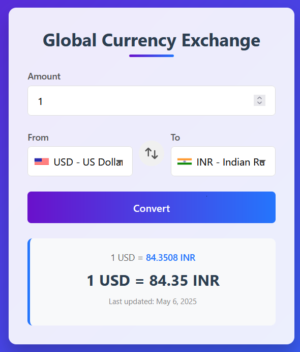

you can access it at - https://xmfaizan.github.io/liveCurrencySwapRate/cc_index.html

learning frontend and concepts of api, from [https://www.youtube.com/watch?v=HcOc7P5BMi4&list=PLfqMhTWNBTe0PY9xunOzsP5kmYIz2Hu7i](https://www.youtube.com/playlist?list=PLfqMhTWNBTe0PY9xunOzsP5kmYIz2Hu7i)

A simple web app that allows users to convert currencies in real-time using the [ExchangeRate API](https://www.exchangerate-api.com/). Built with HTML, CSS, and JavaScript.

## 📁 Project Structure

├── index.html # Main HTML page
├── cc_styles.css # Stylesheet
├── cc_app.js # Main application logic
├── codes.js # Currency and country code mapping

 
